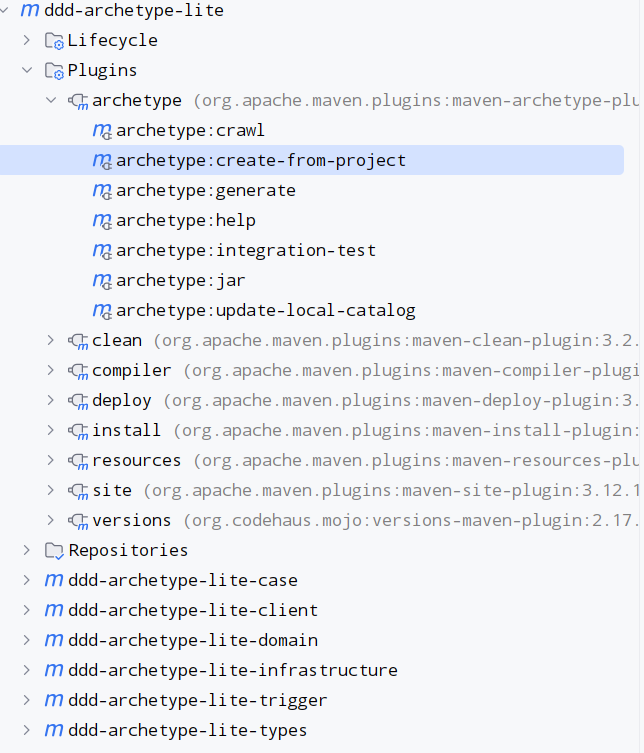
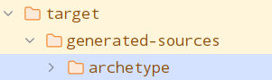
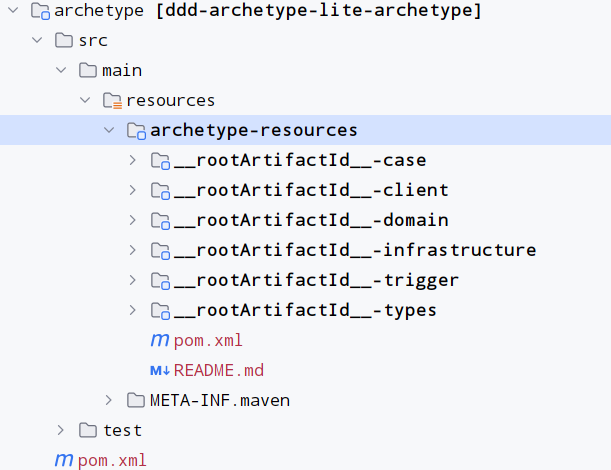
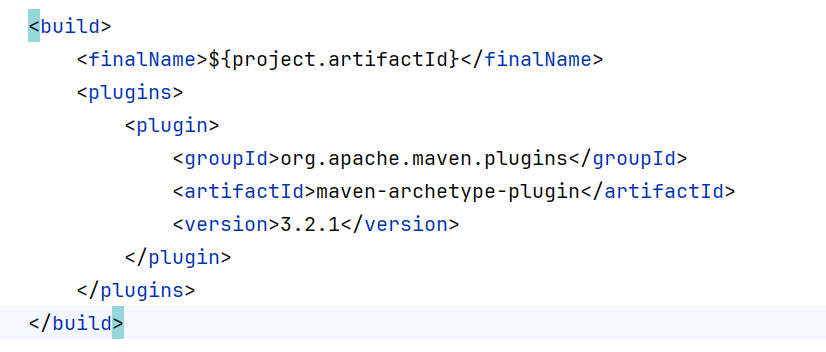

<h1 align="center">DDD Archetype</h1>
<p align="center">
  
  
  
  
  <br>
  
</p>
<hr>

### DDD Archetype 项目文档

#### 简介：

- **项目目的**：该项目旨在为开发者提供一个基于领域驱动设计（DDD）的最佳实践模板。
- **解决问题**：帮助开发者快速搭建符合DDD原则的应用架构，减少初始配置时间，提高开发效率。
- **提供的功能**：
    - 预置了常见的DDD项目结构。
    - 包含了基础的技术栈集成，如Spring Boot、MyBatisPlus等。
    - 提供了示例代码，便于理解DDD的设计模式。

#### 功能：

- **项目结构**：遵循DDD的最佳实践，预定义了模块化的项目结构。
- **技术集成**：集成了Spring Boot、MyBatis等常用技术栈。
- **示例代码**：提供了示例代码，帮助开发者快速上手。
- **配置管理**：提供了详细的配置文件和环境变量管理。
- **测试支持**：内置了单元测试和集成测试框架。

#### 安装指南：

1. **克隆仓库**：
   ```sh
   git clone https://github.com/fzzhuang/ddd-archetype-lite.git
   ```

2. **安装依赖**：
   点击maven，选择plugins中的archetype，执行archetype:create-from-project,生成一个target,将
   target中的archetype复制到根目录. <br/>
    <br/>
    <br/>


3. **修改archetype**:
   <br/>
   <br/>
   删除掉pom中的maven-archetype-plugin插件<br/>
   
4. **执行sh**

```shell
    cd archetype
```

```shell
    mvn clean install
```

#### 许可证：

- **许可证类型**：MIT License
- **意义**：允许用户自由使用、复制、修改和分发项目，但必须保留原作者的版权声明和许可声明。

#### 联系方式：

- **电子邮件**：fzzhuang@outlook.com
- **GitHub**：https://github.com/fzzhuang

#### 技术栈：

- **编程语言**：Java 17
- **框架**：Spring Boot 3.3.0
- **持久层**：MyBatisPlus
- **构建工具**：Maven
- **数据库**：MySQL（或其他关系型数据库）
- **其他**：Lombok、Swagger等